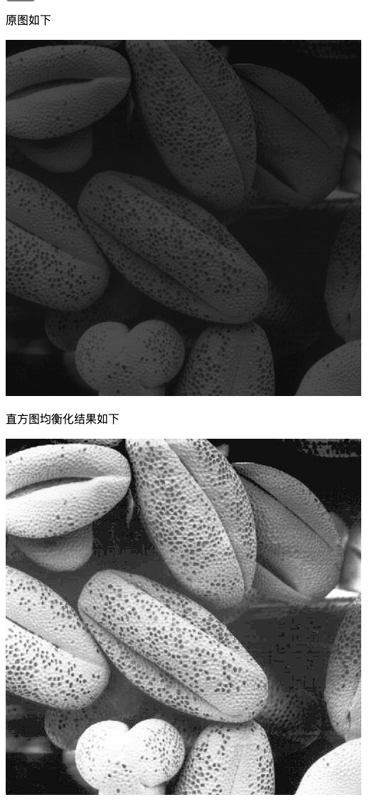
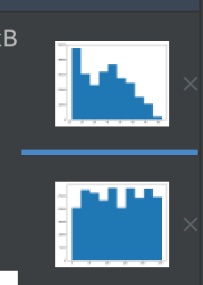
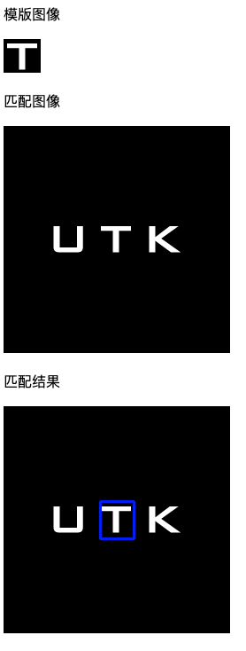
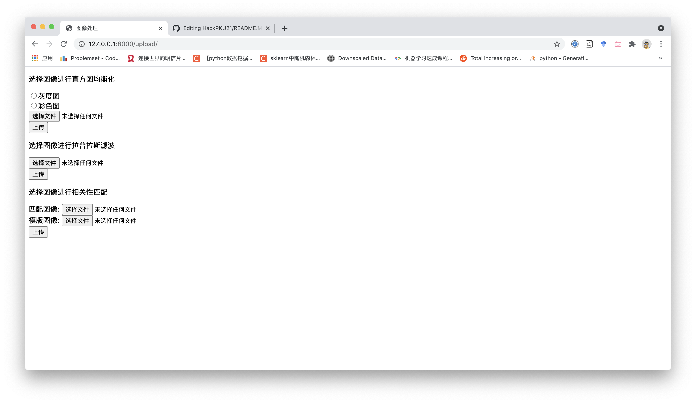
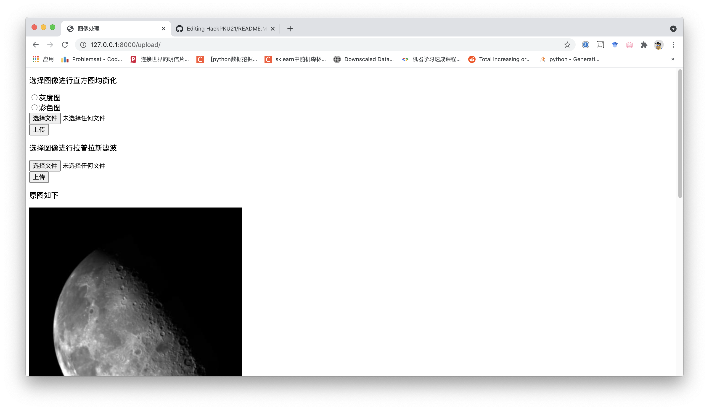

# Digital-Image-Processing-Homework

Homework for Digital Image Processing at PKU Spring 2021.

## 原理说明和实验结果分析

### 原理

函数的具体实现可见`./app.py`或`./upload/views.py`

#### 直方图均衡化

主要实现于`histogram_equal_gray`中，对图像中[0, 255]像素级进行了数量统计存于n[size=256]中并进行归一化，存于p[]中，基于公式$p(r_k)=\frac{n_k}{n}$，之后进行了累计处理（可看作T(r)函数）后据此遍历图像进行了res的计算，即

```python
    n = np.zeros((256), dtype=np.float)
    p = np.zeros((256), dtype=np.float)
    c = np.zeros((256), dtype=np.float)
    for i in range(w):
        for j in range(h):
            n[img_gray[i][j]] += 1
    for i in range(256):
        p[i] = n[i] / float(img_gray.size)
    c[0] = p[0]
    for i in range(1, 256):
        c[i] = c[i-1] + p[i]
    des = np.zeros((w,h), dtype=np.uint8)
    for x in range(w):
        for y in range(h):
            des[x][y] = 255 * c[img_gray[x][y]]
```

针对RGB图像，将图像的B, G, R三通道分离，对每个通道分别进行直方图均衡化，之后再将三通道合并。针对HSI图像，将其变换到RGB空间后进行同样处理。

均衡化结果如下



均衡化前后直方图变化




#### 拉普拉斯锐化滤波

实现于`laplacian`中，`app.py`中还包含对拉普拉斯掩膜结果的可视化`laplacian_filter`，具体操作就是将图像和核做类似卷积的操作之后取反加回原图像中，即

```python
    out[pad: pad + h, pad: pad + w] = img.copy().astype(np.float)
    tmp = out.copy()
    k = [[0., 1., 0.], [1., -4., 1.], [0., 1., 0.]]
    for y in range(h):
        for x in range(w):
            out[pad+y, pad+x] = -1 * np.sum(k * (tmp[y: y+ksize, x: x+ksize])) + tmp[pad+y, pad+x]
```
k为拉普拉斯算子，此处用-4举例，`views.py`中有-8的算子。

#### fft相关性模版匹配 

针对模版和待匹配图像从带匹配图像中顺序划过，计算差别程度，argmax得到最相似地方，返回坐标。结果如下



## run

进入目录后`python3 manage.py runserver`

浏览器访问`127.0.0.1:8000/upload/` 页面即可进行图像处理，具体功能如下



之后按需求进行图片上传，点击提交即可出现结果，如



### 直方图均衡化

进行直方图均衡化，可以选择上传图像是灰度/RGB，之后选择图片上传，点击提交可以查看结果。

### 拉普拉斯滤波进行图像平滑

选择图片上传，支持.jpg, .png, ,tif格式，点击提交查看结果

### fft实现快速模版匹配

选择template和待匹配的图片，提交查看结果

## function 

目录结构为经典Django项目结构

```
./templates 中存储html页面模版
./upload 中实现了主要funcion
./upload/view.py 为主要功能函数实现处，处理前端发来的图片和post请求，结果等
./upload/urls.py 进行了url的设计
```

